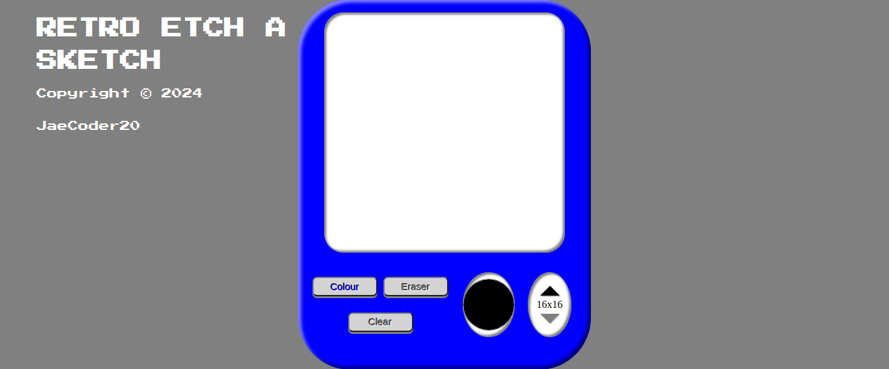

# Retro Etch-a-Sketch

A web-based Etch-a-Sketch application with a nostalgic feel, allowing users to draw, erase, and customize their drawing experience.

## Overview

### Features

- **Color Drawing:** Activate color drawing mode and pick a color using the color picker.
- **Eraser Mode:** Switch to eraser mode to easily remove previous drawings.
- **Adjustable Grid Size:** Customize the size of the drawing grid to fit your preferences.
- **Clear Sketchpad:** Clear the entire sketch pad with a single click.
- **Dynamic Grid Calculation:** Dynamically calculates grid cell dimensions based on the sketch pad size and user input.

## Screenshot

## Live Demo

[Live Demo](#) 

## How to Use

1. Click on the "Color" button to activate color drawing mode.
2. Pick a color using the color picker.
3. Click on the "Eraser" button to activate eraser mode.
4. Click on the "Clear" button to clear the entire sketch pad.
5. Adjust the grid size using the increment and decrement buttons.

## Built With

- HTML5
- CSS
- JavaScript

## What I Learned

- Implemented a dynamic grid system to adapt to different sketch pad sizes.
- Used event listeners to enable drawing and erasing functionality.
- Integrated color picking and eraser modes for a versatile drawing experience.

Copyright © 2024 JaeCoder20
